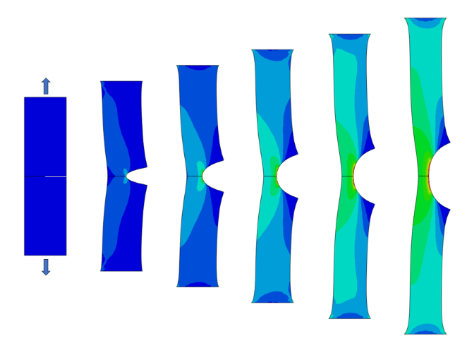

# Example of a single-edge notch specimen

This folder contains an example showcasing the use of the [subroutine](/UMAT_KLP_RK5_hybrid.f) for a 2D single-edge notch tension specimen made out of a viscoelastic elastomer. The simulation relies on generalized plane-strain elements to represent plane stress loading conditions. Only half of the specimen is considered in the simulation.



## Usage

The examples can be run from the command line as follows:
```
abaqus job=SENT_example.inp user=UMAT_KLP_RK5_hybrid.f
```
